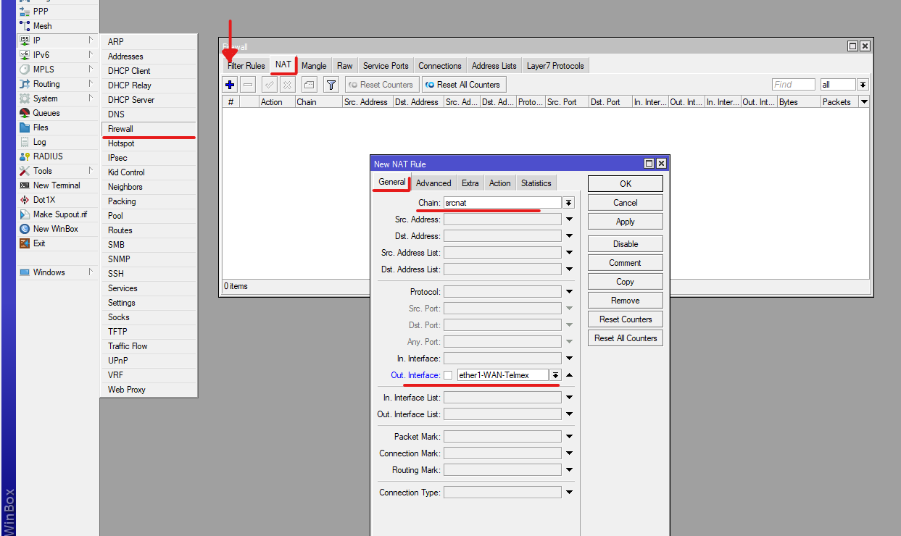

## CONFIGURACIÓN DE ROUTER MikroTik

#### *Esenario: Se tiene que existe una red WAN en el puerto ether1, (proveedor de internet) y en los puertos ether3 y ether4 formaran parte de un misma red lógica por medio de un bidge, por ultimo el puerto ether2 sera una red direrente con una velocidad de bajada de 5mbps y de subida 10mbps, con estas caracteristicas se dara la configuracion para dar salida de internet para todos estos puertos LAN.*

#### 1. CONFIGURACION DE INTERFACES

En el apartado de Interfaces:
Identificar las redes y por puertos, para nombrar correctamente las interfaces

#### 2. ASIGNAR DIRECCIÓN IP A LA WAN 

Optener la IP Automaticamente de la WAN.

Ahora podremos observar que en el apartado de Address se ha agregado la Direccion IP

Tambien puede asignar la IP de la WAN de forma manual.

Nota: La WAN debe coincidir con la que proporciona el proveedor de internet.

Antes de dar configurar la salida de internet a los puertos, es necesario confimar si la conexion esta saliendo a internet.

#### 3. CREAR bridge Y ASIGNAR LOS PUERTOS (Interfaces) A ESTA PARA QUE FORMEN PARTE DE LA MISMA RED LOGICA

#### 4. ASIGNAR DIRECCIÓN IP ALAS interfaces LAN

anteriormente creamos un bridge, y todos los puertos LAN que se les haya asignado estaran en al misma red local.
Cuando asignas una dirección IP a un bridge en un router, estás configurando esa dirección IP en el bridge para que actúe como la interfaz de red lógica para la red que el bridge representa. 

#### 5. AGREGAR SERVICIO DHCP
La configuración de DHCP en un router MikroTik sirve para asignar automáticamente direcciones IP a dispositivos en una red. Cuando asignas el servicio DHCP a un bridge en MikroTik, estás configurando un servidor DHCP para que proporcione direcciones IP a dispositivos conectados a ese bridge.

#### 5. CREAR UNA NAT
La NAT en este contexto se utiliza para permitir que múltiples dispositivos en la red local compartan una única dirección IP pública para acceder a Internet. La NAT realiza la traducción de direcciones, ocultando las direcciones IP locales y permitiendo que los dispositivos internos se comuniquen a través de una dirección IP pública. La NAT también rastrea y administra las conexiones para garantizar que las respuestas del servidor lleguen al dispositivo correcto.

al hacer el nateo de la interfaz que ca a salir por la parte de mosquerede 
Es decir la IP que resivo de la WAN la voy a converir ala direccion IP NAT por eso se enmascara todo lo que entre en el trafico.

#### 6. ASIGNAR DIRECCIÓN IP ALA interface LAN DE LA RED
*Apartir de aqui ya comienza la configuracion de la segunda red*

